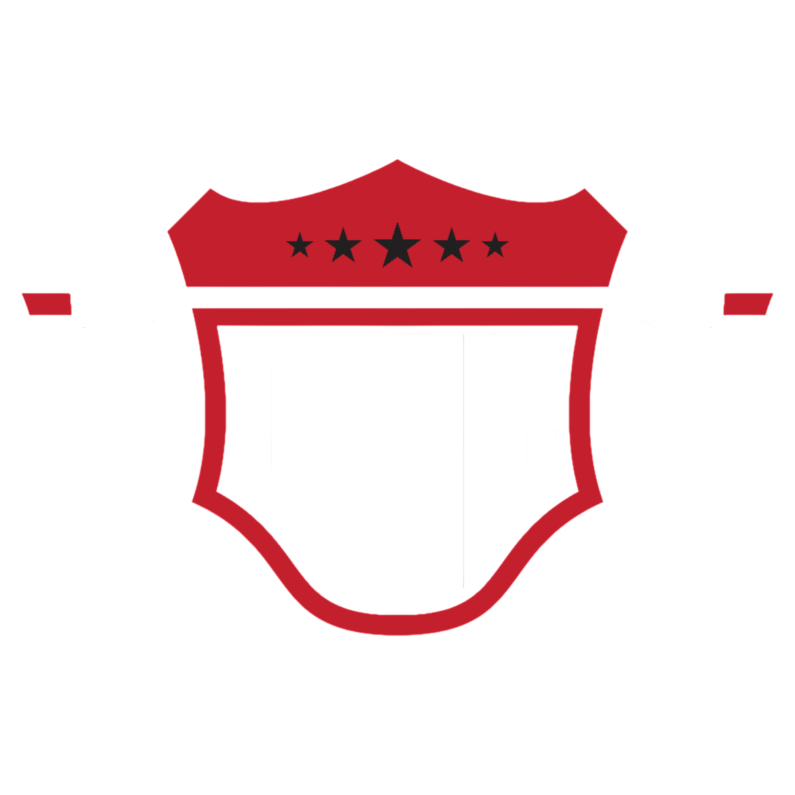

<p align="center">
	<a href="#about">About</a> •
	<a href="#stack">Stack</a> •
	<a href="#running-locally">Running locally</a> •
	<a href="#editing-content">Editing content</a> •
	<a href="#deployment">Deployment</a> •
	<a href="#license">License</a>
</p>

# About

<p align="left">
  
	The <b>Calisthenics Alliance (CAL)</b> is an endurance-focused calisthenics league built around head-to-head battles between athletes. Organized by the <i>Associação B.W.C.R. — Clube de Calistenia das Caldas da Rainha</i> together with clubs and athletes from across the Portuguese calisthenics community, CAL was created to establish a structured, continuous, and fully regulated competitive system for endurance calisthenics. The league consists of multiple events held throughout the season, where athletes face off in one-on-one battles, culminating in a grand final that determines the season’s champion.
</p>

This repository is the league's website: a statically exported, bilingual (PT/EN) marketing and information site.

<br>

# Stack

| Concern   | Choice                                                     |
| --------- | ---------------------------------------------------------- |
| Framework | Next.js 16 App Router, `output: "export"` (fully static)   |
| Styling   | Tailwind CSS v4, dark-only palette taken from the crest    |
| i18n      | `next-intl`, Portuguese default at `/pt`, English at `/en` |
| UI        | Base UI primitives + a small local component set           |
| Motion    | `motion`, globally deferring to `prefers-reduced-motion`   |
| Hosting   | Cloudflare, serving the static export from `out/`          |

<br>

# Running locally

Requires Node.js 22 or newer.

```sh
npm install
npm run dev         # http://localhost:3000 (redirects to /pt)
```

Other scripts:

```sh
npm run build       # static export into ./out
npm run start       # serve the static export locally
npm run typecheck   # tsc --noEmit
npm run lint        # eslint
npm run format      # prettier
npm run assets      # regenerate partner logos and favicons from brand/
```

<br>

# Editing content

Content is deliberately kept out of the components. Almost every change is a data edit:

| What                                                   | Where                                 |
| ------------------------------------------------------ | ------------------------------------- |
| Contacts, Instagram, registration form URL, navigation | `src/config/site.ts`                  |
| Event dates, venues, scoring, fees                     | `src/content/season.ts`               |
| Partner clubs                                          | `src/content/partners.ts`             |
| Announcements (the red bar and the hero notice)        | `src/content/news.ts`                 |
| Event routines                                         | `src/content/routines.ts`             |
| **All** user-facing text, both languages               | `src/translations/pt.json`, `en.json` |
| The regulation PDF                                     | `public/regulations/`                 |
| Original logo files (not deployed)                     | `brand/`                              |

Both translation files must always hold the same set of keys. Lists (`items`, `steps`, …) are plain JSON arrays read with `t.raw()`.

### Adding a season event

Add an entry to `season.events` in `src/content/season.ts`. Give it a `date` to have it appear on the timeline and in the countdown; leave `date: null` and it renders as "to be announced". Add a `slug` only when the event gets a page of its own, and list that page under `events` in `navigation` (`src/config/site.ts`) so it shows up in the menu.

### Brand assets

Everything the browser downloads lives in `public/`, split by media type. `brand/` holds the originals that need processing first — the poster and videos are served as-is, so they go straight into `public/`:

```
public/
  logos/      cal.png, bar-wings.png, bg-bars.png, lion-shield.png
  images/     open-cal-poster.jpg
  videos/     team.mp4 (hero loop), open-cal-trailer.mp4
  regulations/cal-regulamento.pdf

brand/                     originals that need processing before they can be served
  cal.png                  the crest on its black, full resolution
  cal-transparent.png      the crest with alpha, full resolution
  bar-wings.jpg, bg-bars.jpg, lion-shield.jpg
```

`npm run assets` derives the generated ones:

```
brand/<club>.jpg           ->  public/logos/<club>.png          background keyed out to transparency
brand/cal-transparent.png  ->  public/logos/cal.png             downscaled to 320px for the web
brand/cal.png              ->  src/app/{icon,apple-icon}.png    favicons
```

Partner logos arrive with mismatched backgrounds (dark art on white, white type on black, colour art on white), so each is keyed differently before it can sit on the site's dark cards. To add one: drop the original into `brand/`, add an entry to `PARTNER_LOGOS` in `scripts/prepare-assets.mjs`, run `npm run assets`, then commit the generated PNGs — the Cloudflare build never runs sharp.

<br>

# Deployment

Cloudflare Workers Builds builds and publishes the site. Its settings must be:

```
Build command:    npm run build
Deploy command:   npx wrangler deploy
Version command:  npx wrangler versions upload
Root directory:   /
```

The Worker is assets-only — `wrangler.toml` declares no `main`, so no code runs and no CPU
is consumed. `output: "export"` produces the plain files in `out/` that it serves. Do **not** use
`opennextjs-cloudflare`: that adapter wraps the Next.js server for Workers, so every request
re-renders a page that never changes, and RSC prefetches exceed the Worker CPU limit.

Separately, `.github/workflows/ci.yml` typechecks, lints and builds on every push and pull
request. It does not deploy.

The site is served from the root of `https://calisthenicsalliance.com/`, so **no `basePath` is
configured**. If it ever moves under a path prefix, set `basePath` and `assetPrefix` in
`next.config.ts`.

<br>

# License

This project is distributed under the [MIT](https://opensource.org/license/mit) License.
For more information, please refer to the [LICENSE](LICENSE) file.
